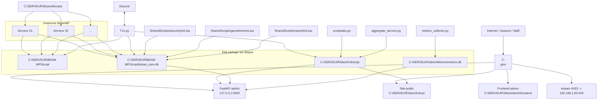
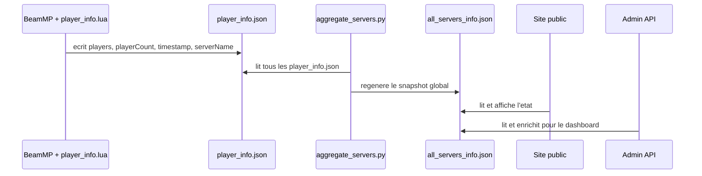
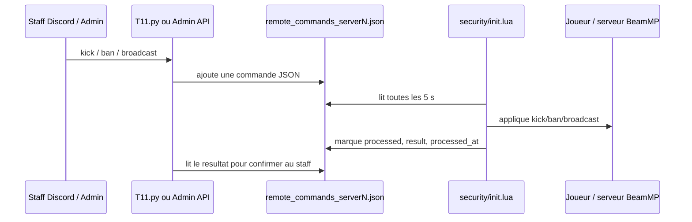
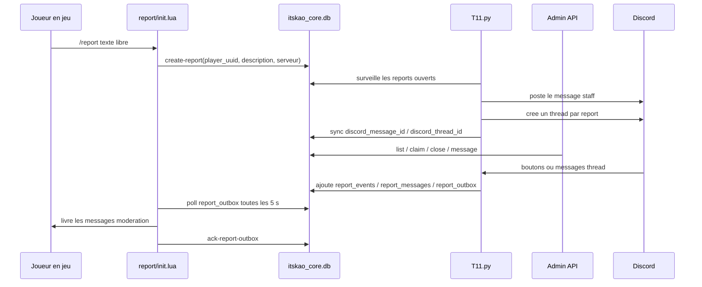

# ItsKao / SERVEUR - Reference systeme complete

Ce document decrit l'etat reel de l'infrastructure ItsKao telle qu'elle est organisee sous `C:\SERVEUR`. Il est centre sur les flux entre composants, les fichiers partages, le chargement des scripts Lua, l'exploitation quotidienne et les points de panne.

Le document utilise `C:\SERVEUR` comme chemin canonique et comme cible normale d'exploitation. Quand un script ou une note parle de `Z:\`, il faut le lire comme une vue reseau de ce meme dossier, utile surtout pour du dev ou de l'acces distant.

## 1. Mise a jour 2026-04-10

L'etat reel de la stack a change sur les points suivants :

- la source de verite metier est maintenant `C:\SERVEUR\BEAM MP\Script\itskao_core.db` ;
- `player_uuid` est l'identite interne commune au gametime, aux sanctions, aux bans, aux sessions et aux reports ;
- `SharedScripts\security\init.lua` resolve l'identite joueur et alimente la DB centrale ;
- `SharedScripts\gametime\init.lua` ecrit les sessions de jeu directement dans `itskao_core.db` ;
- `SharedScripts\report\init.lua` cree les reports et les replies joueur directement en DB ;
- `T11.py` lit les reports / sanctions / bans depuis la DB centrale et cree un thread Discord automatique par report ;
- le backend admin expose maintenant la meme source de verite pour `/api/reports` et les nouvelles routes `/api/players`, `/api/players/{player_uuid}`, `/api/players/merge` et `/api/players/{player_uuid}/split` ;
- `aggregate_servers.py` est maintenant l'unique writer nominal de `C:\SERVEUR\Sites\It'sKao\js\all_servers_info.json` ; `T11.py` le lit en lecture seule ;
- `SharedScripts\report\init.lua` initialise explicitement son propre contexte serveur depuis `ServerConfig.toml`, ce qui fiabilise `server_key` et `server_name` dans les reports ;
- les bridges Lua -> Python critiques (`player_identity.lua`, `ip_privacy.lua`, `gametime\init.lua`) forcent maintenant `py -3 -X utf8` pour preserver les accents ;
- `SharedScripts\report\init.lua` dispose d'un fallback optionnel `ITSKAO_GAME_CHAT_ASCII_FALLBACK` pour translitterer uniquement les messages envoyes au jeu si BeamMP casse encore certains caracteres ;
- `runtime_identifier_events` est desactive en nominal et ne s'alimente que si `ITSKAO_RUNTIME_CAPTURE` est active ;
- `itskao_core_db.py` expose une commande `repair-report-server-context` pour reparer les anciens reports crees avec `serverunknown` ;
- `Demarrer-Tout.ps1` et `Arreter-Tout.ps1` orchestrent maintenant le demarrage et l'arret complets de la stack ;
- `C:\SERVEUR\Report`, `banned_players.json`, `sanctions\*.json` et `gametime.db` ne sont plus la source de verite nominale, seulement des artefacts legacy / migration / archive.

## 2. Resume executif

L'infrastructure s'appuie maintenant sur cinq briques principales :

1. Les instances BeamMP sous `C:\SERVEUR\BEAM MP\NN ...`.
2. Les scripts mutualises sous `C:\SERVEUR\SharedScripts`.
3. La DB metier centrale `C:\SERVEUR\BEAM MP\Script\itskao_core.db`.
4. Les services applicatifs :
   - bot Discord `T11.py`
   - agregateurs Python
   - backend FastAPI admin
5. L'exposition web via `nginx`.

Le systeme n'est plus purement fichier-centrique :

- le live serveur reste couple a des fichiers partages (`player_info.json`, `all_servers_info.json`, `remote_commands_*.json`, `stats.json`) ;
- mais l'identite joueur, les sessions, le gametime, les sanctions, les bans et les reports ont maintenant une source de verite centrale en SQLite.

Le coeur du modele metier est `player_uuid` :

- `security/init.lua` resout ou cree cette identite a partir du runtime BeamMP ;
- `gametime/init.lua` ecrit les sessions et les agregats sur cette identite ;
- `report/init.lua` ouvre les reports sur cette identite ;
- `T11.py` et l'admin manipulent ensuite le meme `player_uuid` au lieu de raisonner uniquement par pseudo.

## 2. Convention de chemins : `C:\SERVEUR` vs `Z:\`

### 2.1 Regle a retenir

- `C:\SERVEUR` est la realite locale sur le Windows Server.
- `C:\SERVEUR` est aussi le seul chemin nominal a retenir pour les scripts et services locaux.
- `Z:\` est un lecteur reseau monte depuis une autre machine et pointant vers ce meme contenu.
- `Z:\` ne doit pas etre traite comme une cible d'exploitation normale, seulement comme un alias de dev / acces distant.

### 2.2 Consequences pratiques

- La doc, les runbooks et les chemins d'exploitation doivent etre lus en `C:\SERVEUR`.
- Si un script historique utilise `Z:\...`, il faut le comprendre comme une vue distante de `C:\SERVEUR\...`.
- `start-support.ps1` a ete realigne sur `C:\SERVEUR\...` ; les anciennes references `Z:\...` ne doivent plus etre considerees comme nominales.
- Les scripts Python et Lua actifs en local utilisent majoritairement `C:\SERVEUR\...`.
- `Z:` n'est donc pertinent que pour un contexte de dev a distance ou de partage reseau.

## 3. Architecture globale



L'idee cle est maintenant double :

- le live BeamMP reste pilote par fichiers pour l'etat serveur et les commandes distantes ;
- le metier joueur, moderation et reports est centralise dans `itskao_core.db`.

## 4. Arborescence fonctionnelle

| Emplacement | Role |
| --- | --- |
| `C:\SERVEUR\BEAM MP` | Instances BeamMP, une par dossier, plus `Script` pour les donnees mutualisees |
| `C:\SERVEUR\BEAM MP\Script` | Etat partage runtime, DB metier centrale, logs, remote commands, config Lua |
| `C:\SERVEUR\SharedScripts` | Vraie logique Lua mutualisee + scripts Python de support |
| `C:\SERVEUR\Report` | Archive historique des anciens reports fichiers, plus source nominale |
| `C:\SERVEUR\Sites\It'sKao` | Site public et donnees live |
| `C:\SERVEUR\Sites\Admin` | Front admin, backend FastAPI, collecteur et logs `run` |
| `C:\SERVEUR\AdminMetrics` | Base SQLite des snapshots admin |
| `C:\SERVEUR\Certificats` | Certificats utilises par `nginx` |
| `C:\SERVEUR\archives` | Archives et scripts legacy retires des zones actives |
| `C:\SERVEUR\base` | Modeles de duplication de serveurs |
| `C:\nginx` | Reverse proxy / serveur statique / stream VPN |

Elements historiques presents mais non centraux :

- `Sites\OLD`
- `Sites\Admin.old`
- `SharedScripts\report\init - old.lua`

## 5. Mode d'execution BeamMP et chargement des scripts Lua

### 5.1 Anatomie d'une instance BeamMP

```text
C:\SERVEUR\BEAM MP\01 SERVEUR WEST COAST
|-- BeamMP-Server.exe
|-- ServerConfig.toml
|-- Server.log
|-- Server.old.log
|-- player_info.json
`-- Resources\Server\
    |-- gametime\init.lua
    |-- security\init.lua
    |-- report\init.lua
    |-- vehicles\init.lua
    |-- mp\init.lua
    |-- pub\init.lua
    |-- race\init.lua
    `-- player_info\init.lua
```

### 5.2 Wrappers locaux, logique centralisee

Les fichiers `Resources\Server\...\init.lua` sont des wrappers tres courts. Exemple observe :

```lua
package.path = package.path .. ';C:/SERVEUR/SharedScripts/?.lua;C:/SERVEUR/SharedScripts/?/init.lua'
return require('security.init')
```

Cela signifie :

- chaque instance charge la meme logique Lua centralisee ;
- la maintenance se fait dans `C:\SERVEUR\SharedScripts`, pas dans 50 copies de code ;
- une modification de `SharedScripts\security\init.lua` affecte toutes les instances qui utilisent ce wrapper.

### 5.3 Ce qui est local a chaque instance

- `ServerConfig.toml`
- `BeamMP-Server.exe`
- `Server.log` / `Server.old.log`
- `player_info.json`

### 5.4 Ce qui est partage entre toutes les instances

- `C:\SERVEUR\BEAM MP\Script\itskao_core.db`
- `C:\SERVEUR\BEAM MP\Script\remote_commands*.json`
- `C:\SERVEUR\BEAM MP\Script\logs\`
- `C:\SERVEUR\BEAM MP\Script\config\ip_privacy_secret.txt`

Artefacts historiques encore presents mais non nominaux :

- `C:\SERVEUR\BEAM MP\Script\banned_players.json`
- `C:\SERVEUR\BEAM MP\Script\sanctions\`
- `C:\SERVEUR\BEAM MP\Script\gametime.db`
- `C:\SERVEUR\Report\`

## 6. Producteurs, consommateurs et cadences

### 6.1 Fichiers et producteurs

| Fichier / dossier | Producteur(s) | Consommateur(s) | Cadence nominale |
| --- | --- | --- | --- |
| `player_info.json` par serveur | `SharedScripts\player_info\init.lua` | `aggregate_servers.py`, `T11.py`, `security\init.lua`, site/admin via agregats | 10 s |
| `Sites\It'sKao\js\all_servers_info.json` | `aggregate_servers.py` (nominal), ancien `archives\beammp-script\aggregate_player_info.py` (legacy) | site public, admin backend, `T11.py`, collecteur metrics | 10 s |
| `Sites\It'sKao\js\stats.json` | `scriptstats.py` | site public | 60 s par defaut |
| `BEAM MP\Script\itskao_core.db` | `security\init.lua`, `gametime\init.lua`, `report\init.lua`, `T11.py`, backend admin, scripts de migration | `T11.py`, backend admin, `scriptstats.py`, commandes in-game et slash commands staff | continu |
| `BEAM MP\Script\remote_commands_*.json` | `T11.py`, backend admin `/api/servers/broadcast` | `security\init.lua` | ecriture ponctuelle, lecture toutes les 5 s |
| `BEAM MP\Script\banned_players.json` | reliquat legacy / migration | lecture de compatibilite ou archive | non nominal |
| `BEAM MP\Script\sanctions\<joueur>.json` | reliquat legacy / migration | lecture de compatibilite ou archive | non nominal |
| `Report\reportN.txt` | archive historique | consultation humaine ponctuelle | non nominal |
| `Report\reportN.json` | archive historique / migration | consultation humaine ponctuelle | non nominal |
| `AdminMetrics\metrics.db` | `metrics_collector.py` | backend admin | 60 s par defaut |
| `donnees-live\discord\record_players.json` | `T11.py` | `T11.py`, backend admin | toutes les 20 s si record depasse |
| `donnees-live\discord\bot_max_servers.json` | `T11.py`, editions manuelles | `T11.py`, backend admin | ponctuel |

### 6.2 Timers et boucles importantes

| Composant | Timer / loop | Intervalle |
| --- | --- | --- |
| `player_info\init.lua` | `updatePlayerInfo` | 10 s |
| `gametime\init.lua` | `autosaveGametime` | 60 s |
| `security\init.lua` | `processRemoteCommands` | 5 s |
| `security\init.lua` | `purgeRecent` | 60 s |
| `security\init.lua` | `enforceExternalBans` | 60 s si active |
| `report\init.lua` | `checkReportUpdates` | 5 s |
| `pub\init.lua` | `sendConseilsEtPubs` | 5 min |
| `pub\init.lua` | `checkWelcomeQueue` | 10 s |
| `T11.py` | `live_updates()` | 20 s |
| `T11.py` | `watch_servers_down()` | 45 s |
| `T11.py` | `scrub_beammp_logs()` | 5 min |
| `T11.py` | `monitor_reports()` | 5 s |
| `aggregate_servers.py` | boucle principale | 10 s |
| `scriptstats.py` | boucle principale | 60 s par defaut |
| `metrics_collector.py` | boucle principale | 60 s par defaut |

### 6.3 Seuils de fraicheur a connaitre

| Composant | Seuil |
| --- | --- |
| `aggregate_servers.py` | `MAX_STALE_SECONDS = 30` pour `serverOnline = OUI/NON` |
| `T11.py` | `INFO_FRESH_SEC = 30`, `INFO_STALE_SEC = 120` |
| `T11.py` fallback log | `HEALTH_FRESH_SEC = 330`, `HEALTH_STALE_SEC = 420` |
| backend admin `merge_servers()` | stale si `seconds_since_last_sample > 180` |
| `metrics_collector.py` | force offline si age payload > `METRICS_STALE_SECONDS`, defaut `300` |

## 7. Flux de donnees exhaustifs

### 7.1 Etat live des serveurs



- `player_info\init.lua` ecrit `player_info.json` dans la racine de chaque serveur.
- `aggregate_servers.py` parcourt tous les dossiers de `C:\SERVEUR\BEAM MP` et agrege les `player_info.json`.
- `aggregate_servers.py` est le seul writer nominal du fichier global ; `T11.py`, le site public et l'admin le lisent ensuite comme snapshot partage.
- `T11.py` conserve bien une fonction `update_servers_info_file()`, mais elle est aujourd'hui stubbee a `return None` et ne constitue plus un writer actif.

Point critique : la source de verite nominale du snapshot global est `aggregate_servers.py`, mais le champ `serverName` peut encore varier selon la qualite de chaque `player_info.json` local ou le fallback au nom de dossier.

### 7.2 Commandes distantes moderation / broadcast



- Le bot T11 route les commandes en fonction de `player_info.json` frais.
- Le backend admin peut aussi injecter des broadcasts via `/api/servers/broadcast`.
- `security\init.lua` traite actuellement trois types effectifs : `kick`, `ban`, `broadcast`.
- Un `ban` avec `duration > 0` est interprete comme tempban.

### 7.3 Reports joueurs



- `report\init.lua` applique un cooldown par `pseudo@ip_hash`.
- le report nominal est maintenant une ligne `reports` en DB, pas un couple `reportN.txt` / `reportN.json`.
- `T11.py` surveille la DB, poste sur Discord, cree un thread et synchronise les identifiants Discord.
- le backend admin lit et modifie la meme DB via `/api/reports`.
- les retours staff vers le joueur passent par `report_outbox`, puis sont acquittes apres livraison.
- les IP ne sont plus conservees en clair : seules `reporter_ip_hash`, `reporter_ip_masked` et `reporter_ip_ref` sont stockees.

Points critiques :

- si `T11.py` est down, le report reste bien en DB mais la publication Discord et la creation du thread prennent du retard ;
- `C:\SERVEUR\Report\` peut encore exister pour l'historique, mais n'est plus la source de verite.

### 7.4 Gametime et stats

- `SharedScripts\security\init.lua` resout d'abord `player_uuid` et ouvre une `player_session`.
- `SharedScripts\gametime\init.lua` mesure ensuite les chunks de session et les ecrit dans `gametime_sessions` / `gametime_totals`.
- `scriptstats.py` lit `itskao_core.db` et produit `C:\SERVEUR\Sites\It'sKao\js\stats.json`.
- `T11.py` lit cette meme DB pour `/gametime`, `/history`, `/baninfo` et les commandes staff associees.
- le dossier `C:\SERVEUR\BEAM MP\Script\gametime\` n'est plus dans le pipeline nominal.
- `gametime.db` n'est plus la source de verite : il peut subsister comme reliquat historique.

### 7.5 Metriques admin

- `metrics_collector.py` lit `all_servers_info.json`.
- Il normalise `serverOnline`.
- Il force offline si la donnee est trop vieille.
- Il stocke des snapshots dans `C:\SERVEUR\AdminMetrics\metrics.db`.

## 8. Formats de donnees et exemples sanitizes

### 8.1 `ServerConfig.toml`

Emplacement :

- `C:\SERVEUR\BEAM MP\NN ...\ServerConfig.toml`

Exemple sanitise :

```toml
[General]
Port = 46501
AuthKey = "<beammp_auth_key>"
AllowGuests = true
LogChat = true
Debug = false
IP = "::"
Private = false
InformationPacket = true
Name = "^lIt'sKao => ^r^oServeur 1 France^r => ^lWest Coast USA (Vanilla)"
Tags = "Freeroam,West-Coast"
MaxCars = 3
MaxPlayers = 50
Map = "/levels/west_coast_usa/info.json"
Description = "FR / EN ..."
ResourceFolder = "Resources"
```

### 8.2 `player_info.json`

Producteur :

- `SharedScripts\player_info\init.lua`

Exemple observe :

```json
{
  "playerCount": 0,
  "players": [],
  "timestamp": 1774340446,
  "serverName": "server1"
}
```

Note : `serverName` est derive de `ServerConfig.toml`, pas du nom du dossier.

### 8.3 `all_servers_info.json`

Producteur nominal :

- `aggregate_servers.py`

Producteurs historiques / legacy :

- ancien `aggregate_player_info.py`

Exemple observe simplifie :

```json
[
  {
    "serverName": "01 SERVEUR WEST COAST",
    "timestamp": 1774340276,
    "players": [],
    "playerCount": 0,
    "serverOnline": "OUI"
  },
  {
    "serverName": "03 SERVER ITALY",
    "timestamp": 1774340285,
    "players": ["PseudoA", "PseudoB"],
    "playerCount": 2,
    "serverOnline": "OUI"
  }
]
```

Notes critiques :

- `aggregate_servers.py` est le seul writer nominal ;
- le champ `serverName` n'a pas une source metier parfaitement stable, car `aggregate_servers.py` reutilise d'abord le `serverName` du `player_info.json` local et ne tombe sur le nom du dossier qu'en fallback ;
- `T11.py` lit ce snapshot et ne l'ecrit plus en nominal.

### 8.4 `remote_commands_serverN.json`

Exemple sanitise :

```json
{
  "commands": [
    {
      "id": "1774300000-1234",
      "type": "kick",
      "target": "PseudoCible",
      "reason": "Ramming",
      "staff": "StaffPseudo",
      "created_at": 1774300000.123,
      "attempts": 0,
      "processed": false
    },
    {
      "id": "1774300005-5678",
      "type": "broadcast",
      "message": "Maintenance dans 5 minutes",
      "staff": "StaffPseudo",
      "staff_display": "StaffPseudo",
      "anonymous": false,
      "created_at": 1774300005.456,
      "processed": false
    }
  ]
}
```

Champs observes ou utilises :

- `id`
- `type`
- `target`
- `reason`
- `message`
- `staff`
- `staff_display`
- `anonymous`
- `duration`
- `attempts`
- `last_attempt`
- `processed`
- `processed_at`
- `result`
- `created_at`

### 8.5 `itskao_core.db` - tables d'identite joueur

Tables concernees :

- `players`
- `player_aliases`
- `external_identifiers`
- `player_sessions`
- `player_links_review`
- `runtime_identifier_events`

Role :

- `players` est la table maitre de l'identite, une ligne par `player_uuid` ;
- `player_aliases` garde l'historique des pseudos observes ;
- `external_identifiers` garde les signaux runtime utiles : `beammp_raw`, `role_raw`, `is_guest_flag`, `ip_hash`, `ip_masked`, `ip_ref` ;
- `player_sessions` garde les connexions BeamMP reelles ;
- `player_links_review` sert a auditer les merge/split ou rapprochements douteux ;
- `runtime_identifier_events` est une boite noire de diagnostic pour capturer ce que BeamMP renvoie vraiment dans `onPlayerAuth` et `onPlayerJoining` ; en nominal, elle ne s'alimente que si `ITSKAO_RUNTIME_CAPTURE` est active.

Exemple simplifie :

```json
{
  "players": {
    "player_uuid": "2ac7a1b8-5c9d-4db4-bb62-5f4c2e0ef8c5",
    "current_name": "PseudoJoueur",
    "needs_review": 0,
    "last_server_key": "server24"
  },
  "external_identifiers": {
    "beammp_raw": "guest123456",
    "role_raw": "user",
    "is_guest_flag": 1,
    "ip_hash": "v1:0123456789abcdef...",
    "ip_masked": "203.0.x.x",
    "ip_ref": "ip#0123456789"
  },
  "player_sessions": {
    "session_uuid": "0cfce4bb-4836-4747-894e-8fdb4c2eb6d6",
    "player_uuid": "2ac7a1b8-5c9d-4db4-bb62-5f4c2e0ef8c5",
    "server_key": "server24",
    "pid": 3,
    "status": "open"
  }
}
```

### 8.6 `itskao_core.db` - gametime, sanctions et bans

Tables concernees :

- `gametime_sessions`
- `gametime_totals`
- `sanctions`
- `ban_states`

Role :

- `gametime_sessions` garde les chunks reelement ecrits par `gametime/init.lua` ;
- `gametime_totals` sert d'agregat rapide pour le site, le bot et les commandes `/gametime` ;
- `sanctions` garde l'historique moderation complet ;
- `ban_states` garde l'etat actif des bans et tempbans pour les checks rapides a la connexion.

Exemple simplifie :

```json
{
  "gametime_totals": {
    "player_uuid": "2ac7a1b8-5c9d-4db4-bb62-5f4c2e0ef8c5",
    "total_seconds": 5748419,
    "current_month": "2026-03",
    "current_month_seconds": 84231
  },
  "sanctions": {
    "sanction_uuid": "7b9d1c1e-a5f8-44d0-b822-cbe09489b6c8",
    "player_uuid": "2ac7a1b8-5c9d-4db4-bb62-5f4c2e0ef8c5",
    "sanction_type": "tempban",
    "reason": "Conduite toxique",
    "staff_name": "StaffPseudo",
    "duration_minutes": 1440
  },
  "ban_states": {
    "player_uuid": "2ac7a1b8-5c9d-4db4-bb62-5f4c2e0ef8c5",
    "reason": "Conduite toxique",
    "ip_hash": "v1:0123456789abcdef...",
    "ip_masked": "203.0.x.x",
    "ip_ref": "ip#0123456789"
  }
}
```

### 8.7 `itskao_core.db` - reports et messagerie staff

Tables concernees :

- `reports`
- `report_events`
- `report_messages`
- `report_outbox`

Role :

- `reports` garde la fiche principale du report ;
- `report_events` journalise creation, claim, close et evenements systeme ;
- `report_messages` stocke les messages structures joueur <-> staff ;
- `report_outbox` est la file des messages a relivrer en jeu au joueur.

Exemple simplifie :

```json
{
  "reports": {
    "report_uuid": "0e3018be-1e56-4db1-81d6-7d0623cc49e1",
    "report_number": 285,
    "reporter_player_uuid": "2ac7a1b8-5c9d-4db4-bb62-5f4c2e0ef8c5",
    "reporter_name_snapshot": "PseudoJoueur",
    "status": "claimed",
    "server_key": "server24",
    "description": "Collision repetitive",
    "discord_message_id": "1486000000000000000",
    "discord_thread_id": "1486000000000000001"
  },
  "report_events": [
    {
      "event_type": "created",
      "author_role": "player",
      "author_name": "PseudoJoueur"
    },
    {
      "event_type": "claimed",
      "author_role": "staff",
      "author_name": "StaffPseudo"
    }
  ],
  "report_outbox": [
    {
      "kind": "staff",
      "message": "On s'occupe de ton report.",
      "delivered": 0
    }
  ]
}
```

Artefacts historiques encore possibles :

- `C:\SERVEUR\BEAM MP\Script\banned_players.json`
- `C:\SERVEUR\BEAM MP\Script\sanctions\*.json`
- `C:\SERVEUR\Report\reportN.txt`
- `C:\SERVEUR\Report\reportN.json`

Ces fichiers doivent maintenant etre lus comme archives ou sources de migration, pas comme la verite nominale.

### 8.8 `stats.json`

Exemple simplifie :

```json
{
  "unique_players": 138248,
  "total_time_minutes": 19781216.17,
  "avg_time_minutes": 143.09,
  "max_time_minutes": 95806.98,
  "top_all_time": [
    { "username": "Pseudo1", "time_minutes": 95806.98 }
  ],
  "current_month": "2026-03",
  "current_month_top": [
    { "username": "Pseudo2", "time_minutes": 5431.32 }
  ],
  "previous_month": "2026-02",
  "previous_month_top": [
    { "username": "Pseudo3", "time_minutes": 6173.82 }
  ],
  "generated_at": "2026-03-24T09:00:00",
  "storage_backend": "sqlite",
  "db_path": "C:/SERVEUR/BEAM MP/Script/itskao_core.db"
}
```

### 8.9 `.env` backend admin

Ne jamais recopier les vraies valeurs en documentation. Utiliser des placeholders.

```dotenv
DISCORD_CLIENT_ID=<discord_client_id>
DISCORD_CLIENT_SECRET=<discord_client_secret>
DISCORD_REDIRECT_URI=https://admin.its-kao.com/oauth/callback
ADMIN_USER_IDS=<discord_user_id_1>,<discord_user_id_2>
SESSION_SECRET=<long_random_secret>
COOKIE_DOMAIN=admin.its-kao.com
COOKIE_SECURE=true
COOKIE_SAMESITE=none
COOKIE_NAME=itskao_admin_session
FRONTEND_BASE_URL=https://admin.its-kao.com
```

### 8.10 Schema SQLite des metriques

```sql
CREATE TABLE IF NOT EXISTS server_snapshots (
    ts INTEGER NOT NULL,
    server_name TEXT NOT NULL,
    player_count INTEGER NOT NULL,
    status INTEGER NOT NULL,
    avg_ping REAL,
    PRIMARY KEY (ts, server_name)
);
```

## 9. Composants Python, PowerShell et batch

### 9.1 `SharedScripts\scripts\T11.py`

Role :

- composant pivot de supervision et moderation Discord.

Responsabilites majeures :

- decouverte des serveurs BeamMP numerotes ;
- calcul de leur etat via `player_info.json`, puis fallback `Server.log` ;
- maintenance des compteurs Discord ;
- lecture du snapshot `all_servers_info.json` produit par `aggregate_servers.py` ;
- routage des commandes moderation vers `remote_commands_*.json` ;
- surveillance DB-first des reports ;
- auto-cloture des reports ouverts sans prise en charge apres 1 heure ;
- suivi incremental des logs staff ;
- demarrage / arret de serveurs via slash commands.

Commandes slash reperees :

- `/broadcast`
- `/players`
- `/status`
- `/listservers`
- `/startserver`
- `/stopserver`
- `/startservers`
- `/createserver`
- `/gametime`
- et d'autres commandes staff autour des bans, historiques, embeds et configuration.

Fichiers lus / ecrits :

- `donnees-live\discord\record_players.json`
- `donnees-live\discord\bot_max_servers.json`
- `Sites\It'sKao\js\all_servers_info.json`
- `BEAM MP\Script\itskao_core.db`
- `BEAM MP\Script\remote_commands*.json`
- `BEAM MP\Script\logs\command_usage_*.txt`
- `BEAM MP\Script\config\permissions_data.lua`

Details importants :

- les seuils `RUNNING / STALE / STOPPED` sont bases d'abord sur `player_info.json`, puis sur l'age de `Server.log` ;
- la decouverte des serveurs est cachee avec un TTL court (`SERVER_DISCOVERY_TTL = 60`) ;
- seuls les dossiers avec prefixe numerique sont decouverts par `discover_beammp_servers()` ;
- les dossiers sans numero, comme `Private`, ne sont donc pas forcement visibles cote bot ;
- `all_servers_info.json` est maintenant une entree en lecture seule pour le bot ; `update_servers_info_file()` est conservee comme stub inert ;
- les commandes staff `/history`, `/ban`, `/tempban`, `/baninfo`, `/unban` et `/chistory` sont rebranchees sur la DB centrale ;
- le flux nominal des reports passe par `reports`, `report_events`, `report_messages` et `report_outbox`, meme si le source conserve encore quelques helpers legacy fichier non nominaux.

### 9.2 `SharedScripts\scripts\aggregate_servers.py`

Role :

- agreger les `player_info.json` des serveurs en un `all_servers_info.json`.

Particularites :

- parcourt tous les sous-dossiers de `C:\SERVEUR\BEAM MP` ;
- est l'unique writer nominal de `all_servers_info.json` ;
- ecrit un tableau JSON compact uniquement si le contenu a change ;
- marque `serverOnline = "OUI"` si la donnee est recente ;
- cadence de 10 secondes ;
- maintient un cache d'inventaire des dossiers et un cache par `player_info.json` base sur `mtime/size`.

### 9.3 `SharedScripts\scripts\scriptstats.py`

Role :

- lire `BEAM MP\Script\itskao_core.db` ;
- calculer `stats.json`.

Particularites :

- boucle par defaut toutes les 60 secondes ;
- supporte des variables d'environnement d'override ;
- lit `gametime_totals` dans `itskao_core.db` en mode nominal ;
- convertit les secondes en minutes dans la sortie publique.

### 9.4 `Sites\Admin\backend\metrics_collector.py`

Role :

- prendre des snapshots de `all_servers_info.json` vers `metrics.db`.

Particularites :

- insertion par bucket temporel ;
- purge des donnees de plus de 90 jours ;
- statut force a offline si la donnee est trop vieille.

### 9.5 `Sites\Admin\backend\main.py`

Role :

- backend FastAPI du centre d'administration.

Routes principales :

- `/oauth/login`
- `/oauth/callback`
- `/api/auth/logout`
- `/api/auth/me`
- `/api/health`
- `/api/servers`
- `/api/servers/detail`
- `/api/servers/broadcast`
- `/api/reports`
- `/api/reports/{report_id}/claim`
- `/api/reports/{report_id}/close`
- `/api/reports/{report_id}/message`
- `/api/players`
- `/api/players/{player_uuid}`
- `/api/players/merge`
- `/api/players/{player_uuid}/split`
- `/api/stats/moderation`
- `/api/logs/tail`

Sources de donnees :

- `all_servers_info.json`
- `metrics.db`
- `itskao_core.db`
- `donnees-live\discord\record_players.json`
- `donnees-live\discord\bot_max_servers.json`
- `ServerConfig.toml`

Particularites :

- construit un catalogue de serveurs a partir des dossiers contenant `ServerConfig.toml` ;
- exclut par defaut les noms contenant `base` et `script` ;
- contrairement au bot T11, il n'exige pas un prefixe numerique ;
- peut donc avoir un univers de serveurs different si les sources de donnees divergent ;
- remappe `/api/reports*` sur les handlers DB-first et expose maintenant des outils de profil joueur, merge et split.

### 9.6 `Sites\Admin\admin-center.ps1`

Role :

- orchestrateur local du backend admin.

Fonctions :

- cree / met a jour `.venv` ;
- installe les dependances ;
- lance `uvicorn main:app --host 0.0.0.0 --port 5000` ;
- lance `metrics_collector.py` ;
- stocke les PID dans `Sites\Admin\run` ;
- redirige stdout/stderr vers les logs du meme dossier ;
- exporte `ITSKAO_ADMIN_ENV_FILE` vers le `.env` du backend.

### 9.7 `start-support.ps1`

Role :

- lancer les services support sans demarrer les serveurs BeamMP.

Jobs lances :

- `T11.py`
- `aggregate_servers.py`
- `scriptstats.py`
- optionnellement `metrics_collector.py`

Particularites :

- utilise `py -3` ;
- tente d'eviter les doublons via inspection des processus Python ;
- utilise maintenant des `WorkDir` en `C:\SERVEUR\...`, alignes sur le mode nominal local.

### 9.8 `Server.bat`

Role :

- lancer toutes les instances ayant `BeamMP-Server.exe`.

Particularites :

- demarrage dans une nouvelle fenetre `cmd.exe` ;
- temporisation de 5 secondes entre chaque instance.

### 9.9 `ServerRange.bat`

Role :

- lancer une plage de serveurs numerotes.

Particularites :

- detection basee sur le prefixe numerique du nom de dossier ;
- demande interactive du premier et du dernier numero.

### 9.10 `Site Start.bat`

Role :

- outil de gestion `nginx`.

Fonctions :

- start ;
- stop ;
- reload ;
- `nginx -t` ;
- ouverture de `nginx.conf` ;
- ouverture du dossier logs ;
- suivi de `error.log`.

### 9.11 `ports-beammp.ps1` et `ports.ps1`

Roles :

- `ports-beammp.ps1` ouvre une plage de ports TCP/UDP, par defaut `46501-46550`.
- `ports.ps1` ouvre des ports saisis interactivement.

### 9.12 Scripts historiques / annexes

- `archives\beammp-script\aggregate_player_info.py`
  Ancien agregateur ecrivant lui aussi `all_servers_info.json`.
- `archives\beammp-script\notifications.ps1`
  Ancien watcher de reports via webhook Discord ; a traiter comme legacy et sensible.

## 10. Scripts Lua detailles

### 10.1 Vue d'ensemble

Les scripts Lua actifs sont sous `C:\SERVEUR\SharedScripts`. Ils sont charges dans chaque instance via des wrappers sous `Resources\Server\...\init.lua`.

Supports transverses importants :

- `C:\SERVEUR\SharedScripts\dkjson.lua`
- `C:\SERVEUR\BEAM MP\Script\permissions.lua`
- `C:\SERVEUR\BEAM MP\Script\config\permissions_data.lua`

### 10.2 `SharedScripts\security\init.lua`

Role metier :

- moderation en jeu ;
- bans a la connexion ;
- commandes staff ;
- resolution d'identite joueur vers `player_uuid` ;
- ouverture / fermeture des `player_sessions` ;
- persistence DB des sanctions et bans ;
- delegation du temps de jeu au module dedie ;
- traitement des commandes distantes ecrites par le bot ou l'admin ;
- broadcast staff ;
- memoire des deconnexions recentes.

Ou il est execute :

- dans chaque processus BeamMP qui charge le wrapper `Resources\Server\security\init.lua`.

Chargement et dependances :

- le wrapper ajoute `C:/SERVEUR/SharedScripts/?.lua` et `C:/SERVEUR/SharedScripts/?/init.lua` au `package.path` ;
- `security\init.lua` ajoute `C:/SERVEUR/BEAM MP/Script/?.lua` ;
- `require("dkjson")` ;
- `require("permissions")` ;
- `require("gametime.init")` ;
- `require("ip_privacy")` ;
- `require("player_identity")`.

Evenements BeamMP enregistres :

- `onPlayerAuth`
- `onPlayerJoining`
- `onChatMessage`
- `onPlayerDisconnect`
- `processRemoteCommands`
- optionnellement `enforceExternalBans`

Timers crees :

- `purgeRecent` toutes les 60 s
- `processRemoteCommands` toutes les 5 s
- `enforceExternalBans` toutes les 60 s si `PASSIVE_BAN_CHECK = true`

Commandes chat exposees :

- `/ban pseudo raison`
- `/kick pseudo raison`
- `/unban pseudo`
- `/tempban pseudo duree raison`
- `/warn pseudo raison`
- `/msgserv message`
- `/session pseudo`
- `/gametime pseudo`
- `/cgametime pseudo`
- `/chistory pseudo`
- `/history pseudo`
- `/dc`

Fichiers lus :

- `player_info.json`
- `C:\SERVEUR\BEAM MP\Script\remote_commands*.json`
- `C:\SERVEUR\BEAM MP\Script\config\permissions_data.lua` via `permissions.lua`
- `C:\SERVEUR\BEAM MP\Script\itskao_core.db` via `player_identity.lua`

Fichiers ecrits :

- `C:\SERVEUR\BEAM MP\Script\logs\command_usage_YYYY-MM-DD.txt`
- `C:\SERVEUR\BEAM MP\Script\remote_commands*.json` pour marquer `processed/result`
- `C:\SERVEUR\BEAM MP\Script\itskao_core.db` pour les resolutions d'identite, sessions, sanctions et bans

Structures memoire importantes :

- `bannedPlayers`
- `activePlayers`
- `lastBanCheck`
- `processedOnce`
- `recentDisconnects`

Note :

- `bannedPlayers`, `bannedPlayersFile` et `sanctionFolder` existent encore dans le source pour compatibilite et heritage, mais le flux nominal bans/sanctions passe maintenant par `player_identity.lua` et `itskao_core.db`.

Effets visibles cote joueur :

- drop a la connexion si banni ;
- drop immediat sur kick/ban/tempban ;
- messages HTML staff ;
- affichage du temps de session et du gametime ;
- broadcast staff in-game.

Effets visibles cote site / bot / admin :

- delegue le gametime a `SharedScripts\gametime\init.lua` ;
- lit et consomme les `remote_commands_*.json` ecrits par le bot et l'admin ;
- journalise les verifications de ban en `IP_HASH / IP_MASKED / IP_REF` pour les usages offline du bot ;
- alimente `players`, `external_identifiers`, `player_sessions`, `sanctions` et `ban_states` dans la DB centrale ;
- capture le runtime brut dans `runtime_identifier_events` pour eviter de rededuire les identifiants a la main depuis les logs texte, mais seulement si `ITSKAO_RUNTIME_CAPTURE` est active.

Parametres importants :

- `DEBUG = false`
- `PASSIVE_BAN_CHECK = false`
- `BROADCAST_MAX_AGE = 120`
- `INFO_STALE_SEC = 20`

Points de fragilite :

- si `player_info.json` est stale, certaines commandes distantes peuvent etre ignorees ;
- si `permissions.lua` ou `permissions_data.lua` est manquant, la moderation locale casse ;
- si `config\ip_privacy_secret.txt` est supprime puis regenere, les anciens `ip_hash` ne matcheront plus les nouvelles connexions ;
- si le launcher Python force en UTF-8 (`py -3 -X utf8`) ou `itskao_core_db.py` ne sont pas disponibles, la resolution d'identite et la moderation DB tombent ;
- `processedOnce` dedup sur 1 heure peut masquer une reemission identique ;
- tout repose sur le dossier partage `C:\SERVEUR\BEAM MP\Script`.

### 10.3 `SharedScripts\report\init.lua`

Role metier :

- creation des reports in-game ;
- anti-spam par joueur/IP pseudonymisee (`pseudo@ip_hash`) ;
- creation DB-first des reports ;
- ajout des reponses joueur sur le report ouvert ;
- livraison des messages moderation vers le joueur ;
- accusés de prise en charge et de cloture.

Chargement et dependances :

- wrapper depuis `Resources\Server\report\init.lua` ;
- ajoute `C:/SERVEUR/SharedScripts/?.lua` si necessaire ;
- `require("ip_privacy")` ;
- `require("player_identity")`.

Evenements / timers :

- `onInit`
- `onChatMessage`
- `checkReportUpdates`
- timer `checkReportUpdates` toutes les 5 s

Commandes chat :

- `/report texte libre`
- `/reply message`
- `/reponse message`

Fichiers lus :

- `ServerConfig.toml`
- `C:\SERVEUR\BEAM MP\Script\itskao_core.db` via `player_identity.lua`

Fichiers ecrits :

- `C:\SERVEUR\BEAM MP\Script\itskao_core.db` via `create-report`, `player-report-reply`, `report-outbox-batch`, `ack-report-outbox-batch`

Structures memoire :

- `lastReportTime` cle `pseudo@ip_hash`
- `watchedPlayers` pour limiter le polling outbox aux joueurs suivis
- `GAME_CHAT_ASCII_FALLBACK` pour le fallback optionnel d'affichage jeu

Effets visibles cote joueur :

- confirmation de report ;
- refus si pas de raison ;
- cooldown anti-spam ;
- messages moderation en jeu ;
- accusés "report pris" et "report cloture" ;
- preservation des accents via le bridge UTF-8, avec translitteration optionnelle seulement si `ITSKAO_GAME_CHAT_ASCII_FALLBACK` est active.

Effets visibles cote bot / admin :

- creation d'une ligne `reports` surveillee par `T11.py` et par le backend admin ;
- le bot cree ensuite le message Discord et le thread associe ;
- les messages staff sont reinjectes cote jeu via `report_outbox` avec lecture et acquittement batch ;
- le plugin initialise lui-meme `server_key` et `server_name` depuis `ServerConfig.toml`, sans dependre d'un autre script Lua deja charge.

Points de fragilite :

- si le joueur n'a pas de `player_uuid` resolvable, le report ne peut pas etre cree ;
- si `T11.py` est down, la publication Discord et le thread prennent du retard mais le report reste en DB ;
- si le joueur n'est pas resolvable au moment de la livraison, le message reste en attente ;
- si BeamMP re-casse certains caracteres malgre le bridge UTF-8, il faut activer explicitement `ITSKAO_GAME_CHAT_ASCII_FALLBACK` au lieu de modifier la DB ou Discord.

### 10.4 `SharedScripts\vehicles\init.lua`

Role metier :

- outils staff/joueur pour lister et supprimer des vehicules.

Chargement et dependances :

- ajoute `C:/SERVEUR/SharedScripts/?.lua` ;
- ajoute `C:/SERVEUR/BEAM MP/Script/?.lua` ;
- `require("dkjson")` ;
- `require("permissions")`.

Evenements :

- `onChatMessage`

Commandes chat :

- `/lv USERNAME`
- `/del USERNAME ID`
- `/del USERNAME all`

Fichiers lus :

- `permissions_data.lua` via `permissions.lua`

Fichiers ecrits :

- `C:\SERVEUR\BEAM MP\Script\logs\command_usage_YYYY-MM-DD.txt`

Particularites techniques :

- supporte plusieurs formats retournes par `MP.GetPlayerVehicles()` ;
- parse aussi les chaines `USER:Nom:PID-VID:{...}`.

Points de fragilite :

- dependance au format BeamMP des vehicules ;
- absence de persistence metier hors logs ;
- tout le controle d'acces depend du meme fichier de permissions que `security`.

### 10.5 `SharedScripts\mp\init.lua`

Role metier :

- messagerie privee entre joueurs.

Chargement et dependances :

- aucune dependance disque externe ;
- HTML optionnel via configuration locale du script.

Evenements / enregistrement :

- utilise `RegisterChatCommand` si disponible ;
- sinon fallback sur `onChatMessage`.

Commandes chat :

- `/mp <ID|Pseudo> <message>`
- `/r <message>`
- `/mphelp`

Fichiers lus / ecrits :

- aucun.

Structures memoire :

- `lastSender[playerID]`

Effets visibles cote joueur :

- DM stylises ;
- reponse rapide via `/r` ;
- hint de reponse.

Points de fragilite :

- aucun historique persistant ;
- `lastSender` perdu au restart ;
- matching partiel pouvant viser le premier pseudo correspondant.

### 10.6 `SharedScripts\pub\init.lua`

Role metier :

- messages de conseil / pub globaux ;
- message de bienvenue sur join.

Evenements / timers :

- timer `sendConseilsEtPubs` toutes les 5 minutes
- timer `checkWelcomeQueue` toutes les 10 secondes
- evenement `onPlayerJoin`

Fichiers lus / ecrits :

- aucun.

Structures memoire :

- `welcomeQueue[playerID] = timeJoined`

Effets visibles cote joueur :

- alternance de conseils et messages promotionnels ;
- message de bienvenue apres l'arrivee.

Point de fragilite :

- le commentaire indique "1 seconde" mais le timer est en realite a 10 secondes, donc la livraison du message de bienvenue peut se faire entre 5 et 10 secondes apres le join.

### 10.7 `SharedScripts\race\init.lua`

Role metier :

- mini-evenements fun de chat :
  - course ;
  - bloom bloom ;
  - steve.

Evenements :

- `onInit`
- `onChatMessage`

Commandes chat :

- `/race`
- `/bloombloom`
- `/steve`

Fichiers lus / ecrits :

- aucun.

Structures memoire :

- `nextAvailableTime`

Points de fragilite :

- cooldown global pour tous ;
- usage de `MP.Sleep()` dans le flux de commande ;
- aucun etat persistant.

### 10.8 `SharedScripts\player_info\init.lua`

Role metier :

- publier l'etat live minimal d'un serveur BeamMP.

Chargement et dependances :

- `require("dkjson")`
- lecture de `ServerConfig.toml`

Evenements / timers :

- timer `updatePlayerInfo` toutes les 10 secondes

Fichiers lus :

- `ServerConfig.toml`

Fichiers ecrits :

- `player_info.json`

Particularites :

- nettoie les codes couleur BeamMP ;
- tente d'extraire le numero de serveur depuis le segment `Serveur N` ;
- produit un `serverName` de forme `serverN`.

Points de fragilite :

- convention de nommage du `ServerConfig.toml` obligatoire ;
- si le nom change de structure, `serverName` devient `serverUnknown`, ce qui perturbe le routage des commandes distantes.

### 10.9 `SharedScripts\dkjson.lua`

Role :

- bibliotheque JSON commune.

Utilisation actuelle :

- `security\init.lua`
- `vehicles\init.lua`
- `player_info\init.lua`
- `gametime\init.lua`

Importance :

- sans `dkjson`, presque tous les flux de persistence Lua cessent de fonctionner.

### 10.10 `BEAM MP\Script\config\permissions_data.lua`

Role :

- liste blanche des pseudos autorises a utiliser les commandes staff cote Lua.

Format :

```lua
return {
    authorizedUsers = {
        "StaffPseudo1",
        "StaffPseudo2"
    }
}
```

Consommateurs :

- `BEAM MP\Script\permissions.lua`
- `SharedScripts\security\init.lua`
- `SharedScripts\vehicles\init.lua`
- `T11.py` pour lecture / ecriture des permissions

Point de fragilite :

- ce fichier sert de pivot commun a plusieurs composants. Une corruption impacte a la fois la moderation Lua et certains outils Discord.

### 10.11 `BEAM MP\Script\config\ranks.lua`

Role :

- fichier Lua statique contenant des classements et roles speciaux (`topPlayers`, `specialRoles`).

Etat d'usage observe :

- aucune reference active n'a ete reperee dans les scripts de production actuels, hors le fichier lui-meme et des copies d'archives sous `Sites\OLD`.

Interpretation :

- a traiter comme fichier de reserve / heritage, pas comme piece centrale du pipeline actuel.

### 10.12 `SharedScripts\report\init - old.lua`

Role :

- ancienne version du script de reports.

Etat :

- non chargee par les wrappers actifs ;
- a conserver comme reference historique seulement.

### 10.13 Support Lua supplementaire : `BEAM MP\Script\permissions.lua`

Role :

- adaptateur simple charge par `security` et `vehicles`.

Fonctionnement :

- execute `dofile("C:/SERVEUR/BEAM MP/Script/config/permissions_data.lua")` ;
- compare le pseudo en minuscules ;
- retourne `true/false`.

Effet de bord :

- imprime les admins charges dans la console, ce qui ajoute du bruit de log mais aide au debug.

### 10.14 `SharedScripts\gametime\init.lua`

Role metier :

- suivre les sessions de jeu en memoire ;
- autosauvegarder le temps de jeu toutes les 60 s ;
- flush le temps de jeu au disconnect ;
- gerer `/gametime` et `/cgametime` en jeu ;
- ecrire directement dans `C:\SERVEUR\BEAM MP\Script\itskao_core.db`.

Ou il est execute :

- charge indirectement par `SharedScripts\security\init.lua` dans chaque serveur BeamMP.

Chargement et dependances :

- `require("dkjson")` ;
- appels externes vers `C:\SERVEUR\SharedScripts\scripts\gametime_db.py` ;
- depend des callbacks fournis par `security\init.lua` (`sendMessage`, `writeLog`, `getPlayerIDFromName`, `hasPermission`).

Evenements / timers :

- expose `autosaveGametime` ;
- cree un timer `autosaveGametime` toutes les 60 s au `setup()` ;
- s'appuie sur `onPlayerJoining` et `onPlayerDisconnect` appeles depuis `security\init.lua`.

Commandes chat exposees :

- `/gametime pseudo`
- `/cgametime pseudo`

Fichiers lus / ecrits :

- lit et ecrit `C:\SERVEUR\BEAM MP\Script\itskao_core.db` via `gametime_db.py` ;
- n'utilise plus aucun fichier `gametime\*.json`.

Structures memoire importantes :

- `playerSessions`

Effets visibles cote joueur :

- le temps de jeu en jeu provient de la base SQLite ;
- une session non encore autosauvegardee est ajoutee a l'affichage de `/gametime` ;
- `/cgametime` reinitialise aussi la session en cours si le joueur est en ligne.

Effets visibles cote site / bot / admin :

- alimente directement `gametime_sessions` et `gametime_totals` dans `itskao_core.db` ;
- simplifie `scriptstats.py` qui ne fait plus de transfert JSON -> DB ;
- aligne le bot T11 et le site sur la meme source de verite.

Points de fragilite :

- depend de la disponibilite du launcher Python force en UTF-8 (`py -3 -X utf8`) sur le serveur ;
- l'autosave est mutualise en batch par serveur via `record-sessions-batch`, mais les snapshots ponctuels et certains resets restent des appels Python externes ;
- aucun parseur Lua local n'etait disponible pendant cette cartographie pour une validation syntaxique automatique du module.

## 11. nginx

### 11.1 Role

- exposition publique du site et de l'admin ;
- terminaison TLS ;
- redirections HTTP -> HTTPS ;
- proxy vers l'admin API ;
- stream TCP `4433` vers OpenVPN.

### 11.2 Configuration observee

Fichier principal :

- `C:\nginx\conf\nginx.conf`

Comportements observes :

- `80` pour redirections web ;
- `443` pour le site public et l'admin ;
- `4433` en `stream` vers `192.168.1.83:443`.

Hosts observes dans `nginx.conf` :

- `its-kao.com` -> redirection vers `https://www.its-kao.com`
- `www.its-kao.com` -> site public statique
- `admin.its-kao.com` -> frontend statique + proxy `/api/` et `/oauth/` vers `127.0.0.1:5000`
- `discord.its-kao.com` -> redirection vers l'invitation Discord
- default server -> redirection vers `https://www.its-kao.com`

### 11.3 Dependance critique

Si rien n'ecoute sur `127.0.0.1:5000`, alors :

- le frontend admin peut etre servi ;
- mais `/api/*` et `/oauth/*` echoueront.

### 11.4 Certificats

Chemin utilise :

- `C:\SERVEUR\Certificats\cert.pem`
- `C:\SERVEUR\Certificats\key.pem`
- `C:\SERVEUR\Certificats\origin_ca_rsa_root.pem`

## 12. Exploitation quotidienne

### 12.1 Sequence de demarrage conseillee

1. Verifier les chemins de lancement.
   Le fonctionnement nominal est local sur `C:\SERVEUR`.
2. Verifier `nginx`.
   Utiliser `Site Start.bat`, puis `nginx -t`.
3. Lancer l'admin center.
   Utiliser `Sites\Admin\admin-center.ps1`.
4. Lancer les services support.
   Utiliser `start-support.ps1`.
5. Lancer les serveurs BeamMP.
   Utiliser `ServerRange.bat` ou `Server.bat`.
6. Verifier les fichiers de vie :
   - `player_info.json`
   - `all_servers_info.json`
   - `BEAM MP\Script\itskao_core.db`
   - `stats.json`
   - `run\backend.out.log`
   - `run\collector.out.log`

Option pratique :

- `Demarrer-Tout.ps1` orchestre `nginx`, backend admin, workers, BeamMP puis `T11.py` dans le bon ordre ;
- `Arreter-Tout.ps1` arrete la stack en ordre inverse : Discord -> BeamMP -> workers -> admin -> `nginx`.

### 12.2 Ajouter / dupliquer un serveur

Procedure cible actuelle :

1. Choisir le modele sous `C:\SERVEUR\base\BASE` ou `C:\SERVEUR\base\HEYRONES Boost`.
2. Copier vers `C:\SERVEUR\BEAM MP\NN NOM`.
3. Regler `ServerConfig.toml` :
   - `Port`
   - `AuthKey`
   - `Name`
   - `Map`
   - `Tags`
4. Verifier les wrappers `Resources\Server\...\init.lua`.
5. Ouvrir le port avec `ports-beammp.ps1` ou `ports.ps1`.
6. Ajouter les metadonnees du site public si necessaire.
7. Demarrer l'instance et verifier `player_info.json`.

### 12.3 Verification post-demarrage

- `player_info.json` bouge toutes les 10 s.
- `Server.log` se rafraichit.
- `all_servers_info.json` contient le serveur et un statut coherent.
- `T11.py` voit le serveur comme `RUNNING` ou `STALE`.
- l'admin affiche le serveur avec un `status_label` coherent.

## 13. Troubleshooting detaille

### 13.1 `nginx` est up mais l'admin API ne repond pas

Verifier :

- port `5000` ;
- `Sites\Admin\run\backend.err.log` ;
- `Sites\Admin\run\backend.out.log` ;
- presence du `.env` et de `ITSKAO_ADMIN_ENV_FILE`.

Cause probable :

- backend non lance ou crash ;
- token / secret / OAuth incorrect ;
- dependances Python manquantes.

### 13.2 Un serveur BeamMP ne publie plus `player_info.json`

Verifier :

- wrapper `Resources\Server\player_info\init.lua` ;
- `SharedScripts\player_info\init.lua` ;
- `ServerConfig.toml` ;
- `Server.log`.

Cause probable :

- script non charge ;
- parse du nom impossible ;
- probleme d'ecriture disque.

### 13.3 `all_servers_info.json` n'est plus regenere

Verifier :

- `aggregate_servers.py` ;
- que `all_servers_info.json` est bien re-ecrit par l'agregateur ;
- que `T11.py` arrive encore a le lire comme snapshot partage ;
- permissions ecriture sur `Sites\It'sKao\js`.

Cause probable :

- aucun producteur actif ;
- exception silencieuse ;
- `player_info.json` corrompu ou stale sur un trop grand nombre de serveurs.

### 13.4 `stats.json` est vide ou obsolete

Verifier :

- `SharedScripts\gametime\init.lua`
- `BEAM MP\Script\itskao_core.db`
- `scriptstats.py`
- permissions d'ecriture sur `Sites\It'sKao\js`

Cause probable :

- service non lance ;
- DB centrale non mise a jour ;
- chemin d'input/output override par environnement.

### 13.5 Un report est cree mais ne remonte pas correctement

Verifier :

- `BEAM MP\Script\itskao_core.db`
- table `reports`
- table `report_events`
- table `report_outbox`
- `T11.py` et `monitor_reports()`
- publication Discord et creation de thread
- droits d'ecriture sur `BEAM MP\Script\`

Cause probable :

- `T11.py` down ou en erreur ;
- echec de synchronisation Discord ;
- report cree sans `player_uuid` resolvable ;
- probleme sur le salon Discord ;
- anciens reports avec `serverunknown` non encore repares via `itskao_core_db.py repair-report-server-context`.

### 13.6 Une commande distante est ecrite mais jamais traitee

Verifier :

- `remote_commands_serverN.json`
- `player_info.json` du serveur cible
- `serverName` -> `serverN`
- timer `processRemoteCommands`
- `result`, `attempts`, `last_attempt`, `processed`

Cause probable :

- `player_info.json` stale ou absent ;
- commande ciblee vers le mauvais fichier ;
- joueur deja parti ;
- commande trop ancienne pour un broadcast.

### 13.7 Un fichier partage ou la DB centrale est corrompu

Zones critiques :

- `itskao_core.db`
- `remote_commands_*.json`
- `all_servers_info.json`

Effets typiques :

- bans ou reports introuvables ;
- admin vide ;
- reports non livrables ;
- stats impossibles a recalculer.

### 13.8 Un ancien script ou un poste de dev mentionne `Z:\`

Verifier :

- que `Z:` est bien un simple alias vers `C:\SERVEUR` ;
- que le poste distant voit le meme contenu et les memes permissions ;
- que l'on ne suit pas par erreur une ancienne consigne `Z:\` dans un contexte de prod locale.

Cause probable :

- partage non monte ;
- execution depuis la mauvaise machine ;
- documentation ou script historique encore formule en `Z:\`.

### 13.9 Un wrapper existe mais la cible dans `SharedScripts` manque

Verifier :

- `Resources\Server\...\init.lua`
- le `require('xxx.init')`
- la presence du dossier `SharedScripts\xxx\init.lua`

Symptome :

- le serveur BeamMP charge le wrapper mais la fonctionnalite n'apparait pas.

### 13.10 Echec d'ecriture dans `itskao_core.db`, `logs` ou les artefacts legacy

Verifier :

- droits NTFS ;
- acces au disque ;
- occupation disque ;
- creation des dossiers par `ensureFolder()` ;
- verrou SQLite ou processus plante.

Effets :

- moderation non persistante ;
- reports bloques ou non livres ;
- stats incompletes ;
- audit staff lacunaire.

## 14. Securite et sauvegarde

### 14.1 Fichiers sensibles

- `ServerConfig.toml` : `AuthKey`
- `Sites\Admin\backend\.env`
- `Sites\Admin\backend\.env.example` si des vraies valeurs y ont ete laissees
- `SharedScripts\scripts\T11.py` si le token Discord y est encore en dur
- `C:\SERVEUR\BEAM MP\Script\config\ip_privacy_secret.txt`
- `archives\beammp-script\notifications.ps1` si un webhook y est encore present
- `C:\SERVEUR\Certificats\*`

### 14.2 Sauvegardes minimales

- `C:\SERVEUR\BEAM MP\Script\itskao_core.db`
- `C:\SERVEUR\BEAM MP\Script\config\ip_privacy_secret.txt`
- `C:\SERVEUR\BEAM MP\Script\remote_commands_*.json`
- `C:\SERVEUR\AdminMetrics\metrics.db`
- `C:\SERVEUR\Sites\Admin\backend\.env`
- `C:\SERVEUR\Certificats\`

Sauvegardes secondaires utiles :

- `C:\SERVEUR\Report\`
- `C:\SERVEUR\BEAM MP\Script\banned_players.json`
- `C:\SERVEUR\BEAM MP\Script\sanctions\`
- `C:\SERVEUR\BEAM MP\Script\gametime.db`

### 14.3 Bonnes pratiques

- ne jamais diffuser le repo brut sans audit des secrets ;
- ne pas supposer que `.env.example` est safe ;
- regenerer / sortir tout token ou webhook present en clair ;
- conserver `config\ip_privacy_secret.txt` de facon stable, sinon la correlation des IP pseudonymisees est perdue ;
- considerer `C:\SERVEUR\BEAM MP\Script` comme zone critique principale ;
- ne traiter `C:\SERVEUR\Report` que comme archive sensible, pas comme source nominale.

## 15. Dette technique et incoherences observees

Observations relevees pendant cette cartographie :

- `T11.py` conserve une fonction `update_servers_info_file()` stubbee a `return None`, ce qui peut preter a confusion alors que `aggregate_servers.py` est le seul writer nominal.
- `T11.py` et `aggregate_servers.py` n'utilisent pas exactement la meme convention de nommage pour `serverName`.
- le bot T11 ne decouvre que les dossiers numerotes, alors que l'admin backend lit plus largement tout dossier avec `ServerConfig.toml` hors mots-clés exclus.
- `nginx.conf` est monolithique et n'inclut pas `conf\site-enabled\00-beta.conf`.
- `conf\site-enabled\00-beta.conf` existe mais son dossier cible `C:\SERVEUR\Sites\Beta\ItsKao` n'est pas present.
- au moment de cette cartographie, rien n'ecoutait sur le port `5000`, ce qui suffit a casser l'API admin meme si `nginx` tourne.
- `T11.py` reference `BASE_SERVER_PATH = C:\SERVEUR\BEAM MP\BASE`, alors que les modeles observes sont sous `C:\SERVEUR\base\BASE` et `C:\SERVEUR\base\HEYRONES Boost`.
- `archives\beammp-script\notifications.ps1` et certains fichiers d'exemple semblent contenir des secrets ou endpoints reels : a traiter comme incident de securite tant que non nettoyes.
- `pub\init.lua` annonce un timer de 1 seconde dans un commentaire, mais utilise en realite 10 secondes.
- le source garde encore quelques reliquats legacy (`bannedPlayersFile`, `sanctionFolder`, helpers reports fichier dans `T11.py`) meme si le flux nominal est DB-first.
- `runtime_identifier_events` ne grossit plus en nominal, mais restera a purger si `ITSKAO_RUNTIME_CAPTURE` est active pour du debug prolonge.

## 16. Conclusion pratique

Pour comprendre cette infra, il faut maintenant la lire comme un systeme hybride :

- BeamMP produit encore des fichiers locaux et partages pour le live serveur ;
- les scripts Lua consomment ces fichiers, mais poussent le metier joueur dans `itskao_core.db` ;
- `T11.py`, les agregateurs Python et le backend admin lisent ensuite soit les fichiers live, soit la DB centrale selon le flux ;
- `nginx` expose ensuite les couches web.

Le bon reflexe de debug est donc :

1. identifier si le flux depend d'un fichier live ou de `itskao_core.db` ;
2. identifier qui est suppose l'ecrire ;
3. identifier qui est suppose le lire ;
4. verifier la cadence de mise a jour ;
5. raisonner d'abord en `C:\SERVEUR`, et ne relire `Z:\` que comme un alias distant si le contexte de dev l'impose.
